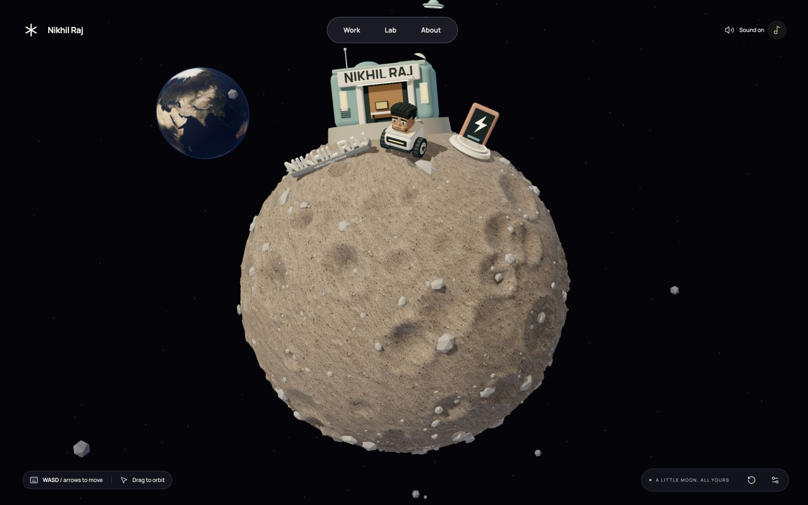
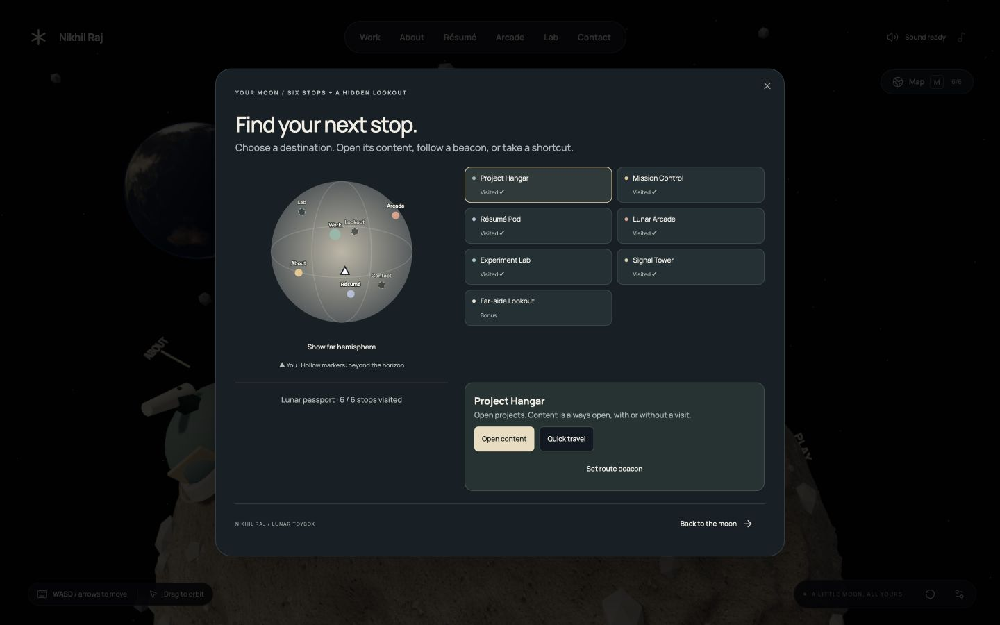

<div align="center">

# Lunar Toybox

**Nikhil Raj’s little corner of the cosmos.**

A playable 3D portfolio on a tiny moon. Drive a curious robot, explore the entire sphere, and follow a few ideas into space.

[Explore the moon](https://nikhil-lunar-toybox.nikhil-063.workers.dev) · [Run locally](#run-locally) · [Controls](#controls) · [Six destinations](docs/MOON-STOPS.md)


</div>

[](https://nikhil-lunar-toybox.nikhil-063.workers.dev)

## A small world, open to explore

There is no “enter” button. Your first movement wakes the robot and eases the camera out to reveal the moon. Every side is reachable, including the poles and the far side.

- **A real 3D world.** Procedural lunar terrain, dimensional Manrope lettering, a mint workshop, a coral charging station, wheel trails and a portrait-inspired robot.
- **A camera you control.** Orbit freely, zoom in for details, or pull back to see the globe with Earth in the distance.
- **A little company.** Friendly UFOs arrive at random intervals and from different directions, pause with a playful message, then head back into space.
- **A responsive soundscape.** Motor startup, idle, acceleration and rolling sounds; quiet space ambience; stereo UFO passes; an optional musical ambient loop.
- **Content without a driving test.** All six stops are always available in navigation. A hemisphere map offers content, quick travel and route beacons. Dialogs pause movement; a simple portfolio view is also available.
- **Considerate defaults.** Music starts off. Audio unlocks with an interaction. Sound preferences persist, hidden tabs pause playback, and motion follows the device preference.

This build includes six destinations, a supplied backend résumé, two playable arcade games, interactive orbit sketches, optional visit stamps and a far-side postcard camera. Additional projects, biography, experience, field notes and unconfirmed contact details intentionally remain empty.

## Controls

| Action | Desktop | Touch |
| --- | --- | --- |
| Move | WASD or arrow keys | Hold the direction pad |
| Boost | Shift while moving | — |
| Orbit | Drag the scene | Drag the scene |
| Zoom | Scroll | Pinch |
| Open a nearby stop | E or Enter | Tap the nearby action |
| Map and destination travel | M or Map button | Map button |
| Return home | R or the reset icon | Reset icon |
| Mute all audio | Speaker icon | Speaker icon |
| Toggle background music | Music-note icon | Music-note icon |

Open settings for individual music, robot/visitor and ambience levels. To invite a visitor immediately, open **Lab → Send a signal**. In the Arcade, Snake uses arrows/WASD and touch directions; both games provide start, pause, reset and exit controls and pause on blur/hidden tabs. At the bonus lookout, photo mode freezes the rover while you orbit/zoom and export a branded PNG. See [destination and game details](docs/MOON-STOPS.md).

## Run locally

Use **Node.js 22.12+** and npm. No API key or environment file is required to run the portfolio.

```bash
git clone https://github.com/nikhiilraj/lunar-toybox.git
cd lunar-toybox
npm ci
npm run dev
```

```bash
npm test          # Arcade rules, travel, stamps, movement, audio, visitors and account guard
npm run build     # Strict TypeScript check and production output
npm run preview   # Serve the production build locally
```

## Built with

| Layer | Tools |
| --- | --- |
| World and renderer | Three.js, WebGPU with WebGL 2 fallback |
| Interface | React, TypeScript, Vite, Tailwind CSS |
| Components | shadcn/ui and Radix, Magic UI, Aceternity UI |
| Motion and icons | Motion, Lucide |
| Typography | Self-hosted Manrope with Inter fallback |
| Sound | Howler, locally served ElevenLabs-generated assets |
| Hosting | Cloudflare Workers Static Assets |

The scene is generated from editable geometry, not a screenshot or a pre-rendered video. No model-generation service, database, analytics service or API connection runs in the browser.

## Make it your own

```text
src/
  lunar-world.ts       Terrain, landmarks, lighting assets and scenery
  assets.ts            Robot geometry and reusable materials
  lunar-motion.ts      Sphere movement, collision clearance and visitor timing
  lunar-game.ts        Render loop, camera, input and interactions
  visitor-flight.ts    Randomized spacecraft paths
  audio-mix.ts         Sound states, gains and transitions
  audio.ts             Playback, gesture unlock and saved preferences
  lunar-app.tsx        Portfolio panels and controls
  destinations.ts     Typed stops, footprints and collision-safe quick travel
  destination-ui.tsx  Accessible globe map and interactive orbit sketches
  arcade-rules.ts     Pure Snake and Snakes & Ladders rules
  arcade.tsx          Game interfaces and lifecycle
  stamps.ts           Optional visited stamps and game best scores
  lunar.css            Theme, typography and responsive layout
  content.ts           Identity, bio and contact links
  components/          UI building blocks
public/assets/         Textures, fonts, sound files and optional robot GLB
public/resume/         Supplied original backend résumé PDF and readable preview
scripts/               Model export and guarded deployment
tests/                 Focused behavior checks
```

Edit `src/content.ts` for identity and contact details, and `src/lunar-app.tsx` for project cards, experience and field notes. Unconfigured contact links are intentionally omitted. The supplied résumé is preserved unchanged; its statements are not used to fill biography or experience automatically. Update its PDF and preview together. Optional visit stamps and game records are stored locally and tolerate blocked storage. See [editing, storage and source boundaries](docs/MOON-STOPS.md). The optional `nikhil-bot.glb` is an interchange export; regenerate it with `npm run export:robot`.

Diagnostic routes: `?debug=1` exposes read-only world/audio data, `?renderer=webgl` selects the fallback renderer, `?quality=low` lowers rendering cost, and `?flat=1` opens the simple portfolio.

## Deploy

```bash
npx wrangler login
npm run deploy
```

Deployment is deliberately pinned to **Nikhil’s Cloudflare account** in `wrangler.jsonc`. The deployment script rejects a conflicting account ID, including one supplied through the environment. It does not select the first account returned by Cloudflare.

A ready-to-enable [GitHub Actions workflow](docs/ci/validate.yml) runs tests and a production build on pushes and pull requests. It is stored as a template because the publishing credential does not have GitHub’s `workflow` scope. Local verification passes all 33 tests and the production build. Deployments are explicit; no Cloudflare credential is stored in this repository. See [deployment notes](docs/DEPLOYMENT.md).

## Sound and attribution

The soundscape uses nine assets generated with **[elevenlabs.io](https://elevenlabs.io/)**: engine start, rev, idle, driving, space ambience, music, and UFO approach, hover and departure. Files are served locally in Ogg/Opus with MP3 alternatives.

The background bed was generated through Sound Effects; the dedicated Music API was unavailable on the generation account. Generated audio remains subject to ElevenLabs’ terms, including the free-tier attribution and non-commercial restrictions. It is not offered under a separate open-source audio license. See [audio details](docs/AUDIO.md) and [asset credits](THIRD_PARTY.md).

## Six destinations, plus a view



Project Hangar, Mission Control, Résumé Pod, Lunar Arcade, Experiment Lab and Signal Tower are implemented. Their landmarks span both hemispheres; the map connects them and optional passport stamps reward physical visits. The far-side lookout adds a rendered lunar postcard export.

Personal content remains deliberately sparse: one real project, the supplied résumé, a verified GitHub link, and empty spaces ready for Nikhil’s own story. Read the [feature status, controls and editing guide](docs/MOON-STOPS.md).

---

Made for **[Nikhil Raj](https://github.com/nikhiilraj)**. Personal branding and original assets remain their owner’s work; upstream libraries and components retain their respective licenses. Public source availability does not grant a blanket license to the complete portfolio.
